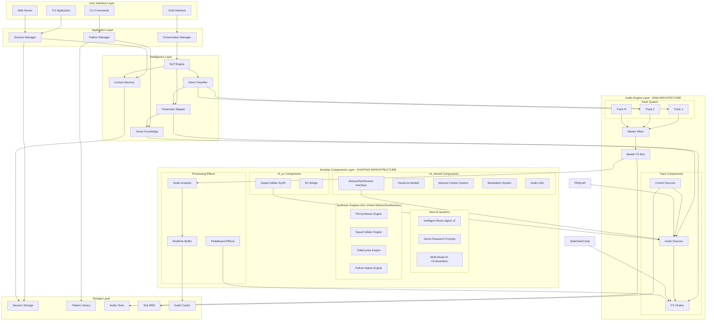

# 🏗️ Hardcore Music Production System - Technical Architecture

## System Architecture Overview

The Hardcore Music Production System combines AI-driven natural language processing with professional audio synthesis and effects. The architecture follows a layered approach with clear separation of concerns, enabling both conversational interaction and direct audio generation.



## Implementation Status

### ✅ Existing Infrastructure (Ready to Use)
#### Modular Components Layer
- **cli_shared/interfaces/synthesizer.py**: Professional AbstractSynthesizer interface
- **cli_shared/models/hardcore_models.py**: Complete data models for hardcore synthesis
- **cli_shared/utils/audio_utils.py**: Reusable audio processing functions
- **cli_strudel/synthesis/fm_synthesizer.py**: Professional FM synthesis with hardcore presets
- **cli_strudel/synthesis/sidechain_compressor.py**: Complete sidechain compression system
- **cli_sc/core/supercollider_synthesizer.py**: SuperCollider backend (basic implementation)

#### Processing Effects
- **Pedalboard Integration**: Professional audio effects processing
- **Audio Analysis**: Spectrum and waveform analysis capabilities
- **Realtime Buffer**: Buffer management for streaming audio

### ✅ New Intelligent Systems (Recently Added)

#### Musical Context System (cli_shared/musical_context.py)
- **Harmonic Framework**: Complete scale and chord system for musical cohesion
- **Key/Scale Awareness**: Project-wide harmonic context for all tracks
- **Chord Progressions**: Built-in knowledge of hardcore-appropriate progressions
- **Integration**: Connects with note_name_to_midi from existing MIDI utilities

#### Modulation System (audio/modulation/modulator.py)
- **LFO Engine**: Low-frequency oscillators for parameter automation
- **Envelope System**: ADSR and complex envelope shapes
- **Automation Lanes**: DAW-style parameter automation
- **Modulation Router**: Flexible parameter mapping and routing

#### FM Synthesis Engine (audio/synthesis/fm_engine.py)
- **6-Operator FM**: Professional DX7-inspired synthesis
- **Hardcore Presets**: Optimized algorithms for gabber/industrial sounds
- **AbstractSynthesizer**: Now properly inherits from existing interface
- **Track Integration**: Compatible with existing Track system via render_pattern_step()

#### Intelligent Music Agent v2 (cli_shared/ai/intelligent_music_agent_v2.py)
- **Multi-Model AI**: Claude, GPT-4, Gemini orchestration
- **Persistent Learning**: SQLite-based cross-session memory
- **Real Analysis**: Audio feedback loops for iterative improvement
- **Creative Generation**: Smart riff and pattern generation

#### Genre Research System (knowledge/genre_research_prompts.md)
- **AI Research Prompts**: 8 comprehensive research templates
- **Authentic Patterns**: Genre-specific knowledge extraction
- **Actionable Data**: Results feed into pattern generators

#### Storage Layer
- **Session Storage**: Data persistence capabilities
- **Pattern Library**: MIDI pattern management
- **Audio Export**: Professional quality WAV output

### ❌ Legacy Code (Scheduled for Elimination)
#### engines/ Folder - SPAGHETTI CODE
- **ProfessionalHardcoreEngine**: Arbitrary inheritance chain
- **FrankensteinEngine**: Good functions locked in bad architecture
- **MidiBasedHardcore**: Reinvents existing cli_shared functionality
- **Problem**: Magic numbers, non-modular design, ignores existing infrastructure

### 🔄 Architecture Refactor Required
#### Track-Based System (NOT YET BUILT)
- **Track Class**: Needs implementation using existing AbstractSynthesizer interface
- **Master Mixer**: Integration point for all tracks
- **Control Sources**: MIDI sequencer, pattern generators
- **Audio Sources**: Integration of cli_strudel FM synth, SuperCollider, Python synthesis
- **FX Chains**: Per-track effects using existing sidechain compressor, Pedalboard

#### Intelligence Layer (Existing but Disconnected)
- **cli_shared/ai/conversation_engine.py**: Complete conversational AI system
- **cli_shared/production/conversational_production_engine.py**: AI-driven production
- **cli_shared/ai/hardcore_knowledge_base.py**: Genre knowledge system
- **Problem**: Not integrated with audio engine layer

### 📋 Refactor Roadmap
1. **Phase 1 (Week 1)**: Standards & Research
   - ✅ Update CLAUDE.md with code quality standards
   - ✅ Create alternative framework research prompt
   - ✅ Fix mermaid diagram with complete architecture
   - 🔄 Audit existing 57 files for code quality

2. **Phase 2 (Week 2-3)**: Clean Architecture
   - 🔄 Eliminate engines/ spaghetti folder entirely
   - 🔄 Build Track class using existing AbstractSynthesizer interface
   - 🔄 Extract reusable functions into proper modules
   - 🔄 Create parameter constants system (eliminate magic numbers)

3. **Phase 3 (Week 4-5)**: Integration
   - 🔄 Connect cli_strudel synthesis components to Track system
   - 🔄 Integrate cli_shared AI systems with audio layer
   - 🔄 Expand cli_sc SuperCollider backend
   - 🔄 Comprehensive testing and performance benchmarking

---

## 🖥️ User Interface Layer

### TUI Application (hardcore_tui.py)
Primary interface built with Textual framework providing real-time interaction.

**Components:**
- **ChatInterface**: Natural language input/output
- **WaveformDisplay**: Real-time audio visualization
- **SpectrumAnalyzer**: Frequency content analysis
- **PatternGrid**: Step sequencer visualization
- **TransportControls**: Playback control
- **StatusPanel**: System state display

**Responsibilities:**
- Handle user input and display responses
- Provide real-time visual feedback
- Manage UI state and updates
- Route commands to appropriate handlers

**Key Interactions:**
```python
# User input flow
user_input -> ChatInterface.on_input_submitted() 
           -> ConversationManager.process_message()
           -> Audio generation/modification
           -> UI updates (waveform, spectrum, grid)
```

### CLI Commands (hardcore_cli.py)
Command-line interface for batch operations and scripting.

**Commands:**
- `generate <genre> <bpm>` - Generate pattern
- `modify <pattern> <params>` - Modify existing pattern  
- `export <session> <format>` - Export audio
- `library list/search/import` - Manage pattern library

---

## 🧠 Intelligence Layer

### NLP Engine (nlp_engine.py)
Central natural language processing with multi-model support.

```python
class NLPEngine:
    def __init__(self):
        self.models = {
            'gemini': GeminiClient(api_key=os.getenv('GEMINI_API_KEY')),
            'claude': ClaudeClient(api_key=os.getenv('ANTHROPIC_API_KEY')),
            'local': LocalNLPModel()  # Fallback offline model
        }
        self.primary_model = 'gemini'  # Configurable
    
    async def process_message(self, message: str, context: dict) -> NLPResponse:
        """Process natural language with intelligent model selection"""
        # Try primary model, fallback on failure
        for model_name in [self.primary_model, 'local']:
            try:
                return await self.models[model_name].process(message, context)
            except Exception as e:
                logger.warning(f"{model_name} failed: {e}")
                continue
        raise Exception("All NLP models failed")
```

### Intent Classifier (intent_classifier.py)
High-accuracy classification of user intentions.

**Intent Types:**
```python
class IntentType(Enum):
    CREATE_PATTERN = "create_pattern"
    MODIFY_SOUND = "modify_sound"
    LAYER_INSTRUMENT = "layer_instrument"
    ARRANGE_PATTERN = "arrange_pattern"
    SAVE_SESSION = "save_session"
    EXPORT_AUDIO = "export_audio"
    LOAD_SESSION = "load_session"
    ANALYZE_AUDIO = "analyze_audio"
```

**Classification Logic:**
```python
INTENT_PATTERNS = {
    IntentType.CREATE_PATTERN: [
        r"make.*(?:kick|beat|pattern|loop)",
        r"create.*(?:gabber|industrial|hardcore)",
        r"generate.*(?:\d+\s*bpm|pattern)"
    ],
    IntentType.MODIFY_SOUND: [
        r"make.*(?:harder|softer|darker|brighter)",
        r"add.*(?:distortion|reverb|compression)",
        r"(?:more|less).*(?:bass|treble|punch)"
    ]
}
```

### Parameter Mapper (parameter_mapper.py)
Translation of natural language modifiers to audio parameters.

**Core Mappings:**
```python
PARAMETER_MAPPINGS = {
    'harder': {
        'distortion': lambda x: min(1.0, x * 1.5),
        'compression_ratio': lambda x: min(20.0, x * 1.3),
        'attack': lambda x: max(0.001, x * 0.7)
    },
    'darker': {
        'lowpass_cutoff': lambda x: max(200, x * 0.6),
        'reverb_damping': lambda x: min(1.0, x * 1.4),
        'high_shelf': lambda x: x - 3.0
    },
    'punchier': {
        'attack_boost': lambda x: min(10.0, x * 1.5),
        'compression_threshold': lambda x: max(-30.0, x - 5.0),
        'transient_shaper': lambda x: min(1.0, x * 1.3)
    }
}
```

### Context Memory (context_memory.py)
Maintains conversation and session context for intelligent responses.

**Memory Types:**
- **Short-term**: Last 10 exchanges, current session state
- **Medium-term**: Session history, user patterns
- **Long-term**: User preferences, vocabulary, common workflows

```python
class ContextMemory:
    def __init__(self):
        self.conversation_history = deque(maxlen=10)
        self.session_context = {}
        self.user_profile = UserProfile()
    
    def update_context(self, user_message: str, bot_response: str, action_taken: dict):
        """Update context with conversation exchange"""
        self.conversation_history.append({
            'timestamp': time.time(),
            'user': user_message,
            'bot': bot_response,
            'action': action_taken,
            'session_state': self.session_context.copy()
        })
    
    def get_relevant_context(self, current_message: str) -> dict:
        """Retrieve relevant context for processing current message"""
        return {
            'recent_patterns': self.get_recent_patterns(),
            'current_instruments': self.session_context.get('instruments', {}),
            'user_preferences': self.user_profile.get_preferences(),
            'conversation_flow': list(self.conversation_history)[-3:]
        }
```

---

## 🎵 Audio Engine Layer

### Multi-Instrument Synthesizer (synthesizer.py)
High-quality synthesis engine supporting all hardcore instruments.

**Architecture:**
```python
class HardcoreSynthesizer:
    def __init__(self, sample_rate=44100):
        self.sample_rate = sample_rate
        self.instruments = {
            InstrumentType.GABBER_KICK: GabberKickSynth(),
            InstrumentType.ACID_BASS: AcidBassSynth(),
            InstrumentType.HOOVER_LEAD: HooverLeadSynth(),
            # ... all instrument types
        }
        self.effects_rack = EffectsRack()
    
    async def synthesize_instrument(self, 
                                    instrument_type: InstrumentType,
                                    parameters: InstrumentParams,
                                    duration: float) -> np.ndarray:
        """Generate high-quality audio for specified instrument"""
        synth = self.instruments[instrument_type]
        dry_signal = await synth.generate(parameters, duration, self.sample_rate)
        processed_signal = await self.effects_rack.process(dry_signal, parameters.effects)
        return processed_signal
```

**Synthesis Algorithms:**
- **Kicks**: TR-909 modeling with pitch envelopes, harmonic distortion
- **Bass**: Virtual analog with resonant filters, LFO modulation
- **Leads**: Supersaw/hoover synthesis with formant filtering
- **Arps**: Pattern-based note generation with effects automation
- **Pads**: Multi-voice synthesis with stereo spreading

### Pattern Sequencer (sequencer.py)
Precise timing engine supporting complex patterns at high BPMs.

**Features:**
- Sample-accurate timing up to 250 BPM
- Per-track pattern data with swing/groove
- Real-time pattern modification
- Euclidean rhythm generation
- Pattern evolution algorithms

```python
class PatternSequencer:
    def __init__(self, sample_rate=44100):
        self.sample_rate = sample_rate
        self.tracks = {}
        self.master_clock = MasterClock()
        self.swing_amount = 0.0
    
    def add_track(self, name: str, instrument_type: InstrumentType, pattern: str):
        """Add instrument track with pattern"""
        self.tracks[name] = Track(
            instrument_type=instrument_type,
            pattern=self.parse_pattern(pattern),
            parameters=InstrumentParams()
        )
    
    async def render_pattern(self, bars: int, bpm: int) -> np.ndarray:
        """Render complete pattern with all tracks"""
        total_samples = self.calculate_samples(bars, bpm)
        mixed_audio = np.zeros(total_samples)
        
        for track in self.tracks.values():
            track_audio = await self.render_track(track, bars, bpm)
            mixed_audio += track_audio
            
        return mixed_audio
```

### Real-time Mixer (mixer.py)
Professional mixing console with per-track processing.

**Features:**
- Individual track volume, pan, EQ
- Send/return effects
- Real-time parameter automation
- Master bus processing
- Stereo imaging and width control

### Effects Chain (effects.py)
Professional audio effects optimized for hardcore genres.

**Core Effects:**
```python
class EffectsRack:
    def __init__(self):
        self.effects = {
            'distortion': DistortionEffect(),
            'compression': CompressionEffect(),
            'eq': EQEffect(),
            'reverb': ReverbEffect(),
            'delay': DelayEffect(),
            'filter': FilterEffect(),
            'bitcrush': BitcrushEffect(),
            'limiter': LimiterEffect()
        }
    
    async def process_chain(self, audio: np.ndarray, chain: List[dict]) -> np.ndarray:
        """Process audio through effects chain"""
        processed = audio.copy()
        for effect_config in chain:
            effect = self.effects[effect_config['type']]
            processed = await effect.process(processed, effect_config['params'])
        return processed
```

---

## 💾 Storage Layer

### Session Storage (session_storage.py)
Handles complete session persistence with audio stems.

**Session Format:**
```python
@dataclass
class Session:
    metadata: SessionMetadata
    tracks: Dict[str, Track]
    master_settings: MasterSettings
    conversation_history: List[ConversationExchange]
    audio_stems: Dict[str, str]  # track_name -> audio_file_path
    
    def save(self, filepath: Path):
        """Save session with audio stems"""
        session_dir = filepath.parent / filepath.stem
        session_dir.mkdir(exist_ok=True)
        
        # Save audio stems
        for track_name, audio_data in self.get_audio_stems().items():
            stem_file = session_dir / f"{track_name}.wav"
            save_audio(audio_data, stem_file)
            self.audio_stems[track_name] = str(stem_file.relative_to(filepath.parent))
        
        # Save session metadata
        with open(filepath, 'w') as f:
            json.dump(asdict(self), f, indent=2)
```

### Pattern Library (pattern_library.py)
Searchable database of user patterns with metadata.

**Features:**
- Tag-based organization
- Full-text search in descriptions
- Audio preview generation
- Usage analytics and recommendations
- Import/export between systems

```python
class PatternLibrary:
    def __init__(self, library_path: Path):
        self.library_path = library_path
        self.index = self.load_index()
    
    def add_pattern(self, pattern: Pattern, tags: List[str] = None):
        """Add pattern to library with metadata"""
        pattern_id = str(uuid.uuid4())
        
        # Generate audio preview
        preview_audio = self.synthesizer.render_pattern(pattern, bars=1)
        preview_file = self.library_path / f"{pattern_id}_preview.wav"
        save_audio(preview_audio, preview_file)
        
        # Create library entry
        entry = PatternLibraryEntry(
            id=pattern_id,
            pattern=pattern,
            tags=tags or [],
            audio_preview=str(preview_file),
            created_date=datetime.now(),
            usage_count=0
        )
        
        self.index[pattern_id] = entry
        self.save_index()
    
    def search(self, query: str, filters: dict = None) -> List[PatternLibraryEntry]:
        """Search patterns by text and filters"""
        results = []
        for entry in self.index.values():
            if self.matches_query(entry, query, filters):
                results.append(entry)
        return sorted(results, key=lambda x: x.usage_count, reverse=True)
```

---

## 🔧 Performance & Optimization

### Memory Management
- **Audio Caching**: LRU cache for generated audio to avoid regeneration
- **Session Limits**: 50MB memory limit per session with automatic cleanup
- **Streaming Audio**: Large patterns streamed rather than loaded entirely

### Real-time Performance
- **Audio Threading**: Separate thread for audio generation/playback
- **Non-blocking UI**: Asynchronous operations prevent UI freezing
- **Buffer Management**: Intelligent audio buffering for smooth playback

### Quality Assurance
- **Automated Testing**: Continuous audio quality validation
- **Performance Monitoring**: Real-time metrics collection
- **Error Recovery**: Graceful degradation when components fail

---

## 📡 API Integration

### Multi-Model AI Support
```python
class AIModelManager:
    def __init__(self):
        self.models = {
            'gemini': self.init_gemini(),
            'claude': self.init_claude(),
            'local': self.init_local_model()
        }
        self.model_selector = ModelSelector()
    
    def init_gemini(self):
        """Initialize Google Gemini"""
        import google.generativeai as genai
        genai.configure(api_key=os.getenv('GEMINI_API_KEY'))
        return genai.GenerativeModel('gemini-pro')
    
    def init_claude(self):
        """Initialize Anthropic Claude"""
        import anthropic
        return anthropic.Client(api_key=os.getenv('ANTHROPIC_API_KEY'))
    
    async def process_with_best_model(self, prompt: str, context: dict) -> str:
        """Route to best available model based on query type and performance"""
        model_choice = self.model_selector.select_model(prompt, context)
        
        for model_name in [model_choice, 'local']:  # Fallback to local
            try:
                return await self.models[model_name].generate(prompt, context)
            except Exception as e:
                logger.warning(f"Model {model_name} failed: {e}")
                continue
        
        raise Exception("All AI models failed")
```

---

## 🧪 Testing Architecture

### Test Organization
```
tests/
├── unit/                    # Component unit tests
│   ├── test_synthesizer.py
│   ├── test_sequencer.py
│   ├── test_nlp_engine.py
│   └── test_effects.py
├── integration/             # Component integration tests
│   ├── test_audio_pipeline.py
│   ├── test_conversation_flow.py
│   └── test_session_management.py
├── audio_quality/          # Audio quality validation
│   ├── test_gabber_kicks.py
│   ├── test_frequency_content.py
│   └── test_distortion_character.py
├── performance/            # Performance and benchmarks
│   ├── test_generation_speed.py
│   ├── test_memory_usage.py
│   └── test_real_time_latency.py
└── fixtures/              # Test data and audio samples
    ├── reference_patterns/
    ├── conversation_flows.json
    └── quality_standards.json
```

### Continuous Integration
- **Audio Quality Gates**: Generated audio must pass quality metrics
- **Performance Regression**: Monitor generation speed and memory usage
- **Cross-platform Testing**: Linux, macOS, WSL2 compatibility
- **Model Reliability**: Test AI model fallback scenarios

This technical architecture provides the foundation for building a professional, scalable, and maintainable hardcore music production tool that delivers on the ambitious vision while maintaining code quality and performance standards.