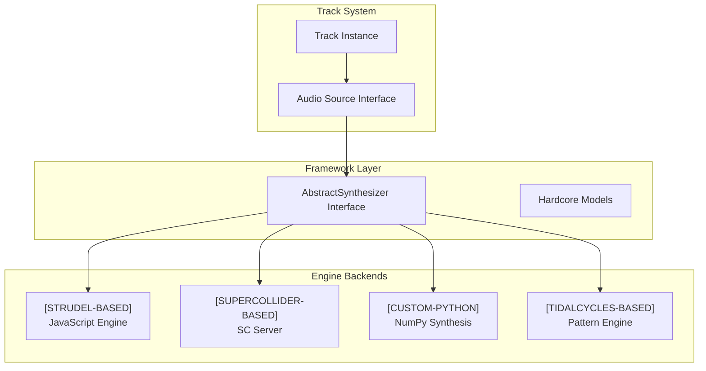

# 🔧 Engine Integration Guide

## Overview

The Track system supports multiple audio engines through the AbstractSynthesizer interface. Each engine type serves different purposes:

- **[FRAMEWORK-AGNOSTIC]**: Pure Python abstractions (cli_shared/)
- **[STRUDEL-BASED]**: JavaScript live coding integration (cli_strudel/)  
- **[SUPERCOLLIDER-BASED]**: Professional synthesis server (cli_sc/)
- **[CUSTOM-PYTHON]**: NumPy/SciPy direct synthesis (audio/)
- **[TIDALCYCLES-BASED]**: Advanced pattern language (future cli_tidal/)

## Engine Architecture



## Engine Implementations

### Strudel Integration (JavaScript)

**File**: `cli_strudel/synthesis/fm_synthesizer.py`
**Engine Type**: `[STRUDEL-BASED]`

```python
"""
Engine Type: [STRUDEL-BASED]
Dependencies: Strudel.js, Node.js, Python-JavaScript bridge
Abstraction Level: [LOW-LEVEL]
"""

class StrudelFMSynth(AbstractSynthesizer):
    def generate_audio(self, params, duration):
        # Translates Python parameters to Strudel.js calls
        strudel_code = self.params_to_strudel(params)
        return self.execute_strudel(strudel_code)
```

**Characteristics**:
- ✅ Excellent for live coding and complex patterns
- ✅ Rich ecosystem of web audio synthesis
- ⚠️ Requires Node.js runtime and JavaScript bridge
- ⚠️ Startup overhead (~500ms)

### SuperCollider Integration (Server)

**File**: `cli_sc/core/supercollider_synthesizer.py`
**Engine Type**: `[SUPERCOLLIDER-BASED]`

```python
"""
Engine Type: [SUPERCOLLIDER-BASED]
Dependencies: SuperCollider server (scsynth), Supriya, OSC protocol
Abstraction Level: [HIGH-LEVEL]
Communication: Python ↔ SuperCollider via Supriya library
"""

import asyncio
from supriya import Server, Synth, SynthDef, Group
from supriya.ugens import Out, SinOsc, EnvGen, Env

class SuperColliderSynth(AbstractSynthesizer):
    def __init__(self):
        self.server = Server()
        self.synth_defs = {}
        
    async def start(self):
        """Start SuperCollider server with Supriya"""
        await self.server.boot()
        await self.load_synth_definitions()
        
    async def load_synth_definitions(self):
        """Define hardcore-specific SynthDefs"""
        # TR-909 style kick drum
        kick_synthdef = SynthDef(
            "hardcore_kick",
            frequency=60,
            duration=0.5,
            distortion=0.8,
            out_bus=0,
        )
        kick_synthdef.add_ugen(
            Out.ar(
                bus=kick_synthdef["out_bus"],
                source=self.generate_kick_ugens(kick_synthdef)
            )
        )
        await kick_synthdef.add_to_server(self.server)
        self.synth_defs["kick"] = kick_synthdef
        
    def generate_audio(self, params, duration):
        """Generate audio using Supriya + SuperCollider"""
        async def _generate():
            # Create synth instance from definition
            synth = Synth(
                synthdef=self.synth_defs[params.synth_type],
                frequency=params.frequency,
                duration=params.duration,
                distortion=params.distortion
            )
            
            # Add to server and play
            await synth.add_to_head(self.server.default_group)
            
            # Record output
            audio_data = await self.server.record(duration)
            return audio_data
            
        return asyncio.run(_generate())
```

**Supriya-Specific Patterns**:

```python
# Pattern 1: Async Server Management
async def manage_sc_server():
    server = Server()
    await server.boot()
    try:
        # Your audio processing
        pass
    finally:
        await server.quit()

# Pattern 2: Dynamic SynthDef Creation
def create_dynamic_synthdef(params):
    """Build SynthDef from user parameters"""
    with SynthDefBuilder(
        frequency=440,
        amplitude=0.5,
    ) as builder:
        source = SinOsc.ar(frequency=builder["frequency"])
        source *= builder["amplitude"]
        Out.ar(bus=0, source=source)
    return builder.build()

# Pattern 3: Real-time Parameter Control
class RealtimeController:
    def __init__(self, server):
        self.server = server
        self.active_synths = {}
        
    async def update_parameter(self, synth_id, param, value):
        """Update synth parameters in real-time via OSC"""
        if synth_id in self.active_synths:
            synth = self.active_synths[synth_id]
            await synth.set(**{param: value})
```

**Characteristics**:
- ✅ Professional quality synthesis
- ✅ Excellent for real-time processing (<20ms latency achievable)
- ✅ Industry standard for electronic music
- ✅ Async/await support for non-blocking operations
- ✅ Pythonic API via Supriya
- ⚠️ Requires SuperCollider server installation
- ⚠️ Longer startup time (~1s)

### Custom Python Synthesis (Direct)

**File**: `audio/synthesis/oscillators.py`
**Engine Type**: `[CUSTOM-PYTHON]`

```python
"""
Engine Type: [CUSTOM-PYTHON] 
Dependencies: NumPy, SciPy, pure Python mathematics
Abstraction Level: [LOW-LEVEL]
"""

class KickAudioSource(AudioSource):
    def generate_audio(self, params, sample_rate):
        # Direct NumPy synthesis - no external dependencies
        return synthesize_simple_kick(params.frequency, params.duration_ms)
```

**Characteristics**:
- ✅ No external dependencies
- ✅ Immediate startup (0ms)
- ✅ Full control over synthesis algorithms
- ⚠️ Limited compared to professional engines
- ⚠️ Requires manual implementation of complex synthesis

### TidalCycles Integration (Future)

**File**: `cli_tidal/core/tidal_synthesizer.py` (planned)
**Engine Type**: `[TIDALCYCLES-BASED]`

```python
"""
Engine Type: [TIDALCYCLES-BASED]
Dependencies: TidalCycles, Haskell runtime, SuperDirt
Abstraction Level: [HIGH-LEVEL]
"""

class TidalCyclesSynth(AbstractSynthesizer):
    def generate_audio(self, params, duration):
        # Translates to TidalCycles patterns 
        tidal_pattern = self.params_to_tidal(params)
        return self.tidal_bridge.evaluate(tidal_pattern)
```

**Planned Characteristics**:
- ✅ Most advanced pattern generation capabilities
- ✅ Excellent for complex rhythmic structures  
- ✅ Integrates well with SuperCollider via SuperDirt
- ⚠️ Requires Haskell runtime and TidalCycles installation
- ⚠️ Steeper learning curve

## Engine Selection Guide

### When to Use Each Engine

| Use Case | Recommended Engine | Rationale |
|----------|-------------------|-----------|
| **Quick Prototyping** | Custom Python | Immediate startup, no dependencies |
| **Live Coding Performance** | Strudel | Interactive JavaScript environment |
| **Professional Production** | SuperCollider | Industry standard quality |
| **Complex Pattern Generation** | TidalCycles | Advanced pattern language |
| **Mobile/Embedded** | Custom Python | No external runtime required |
| **Web Integration** | Strudel | Native web audio support |

### Performance Comparison

| Engine | Startup Time | CPU Usage | Memory | Audio Quality |
|--------|--------------|-----------|--------|---------------|
| Custom Python | 0ms | Low | 10MB | Good |
| Strudel | ~500ms | Medium | 50MB | Very Good |
| SuperCollider | ~1s | Medium | 30MB | Excellent |
| TidalCycles | ~2s | Medium | 40MB | Excellent |

## Implementation Requirements

### AbstractSynthesizer Interface

All engines must implement:

```python
from cli_shared.interfaces.synthesizer import AbstractSynthesizer

class MyEngine(AbstractSynthesizer):
    def __init__(self, backend_type: BackendType):
        super().__init__(backend_type)
        
    async def start(self) -> bool:
        """Start engine and return success"""
        pass
        
    async def stop(self) -> bool:
        """Stop engine and cleanup"""
        pass
        
    async def synthesize_pattern(self, pattern: HardcorePattern) -> np.ndarray:
        """Generate audio from pattern"""
        pass
        
    async def render_pattern_step(self, velocity: float, params: SynthParams) -> np.ndarray:
        """Render single pattern step"""
        pass
```

### Engine Tagging Requirements

All engine modules must include:

```python
"""
Engine Type: [ENGINE-TYPE]
Dependencies: [specific dependencies]
Abstraction Level: [LOW-LEVEL] | [MID-LEVEL] | [HIGH-LEVEL]
Integration: [how it integrates with Track system]
"""
```

## Adding New Engines

### Step 1: Create Engine Module
```bash
mkdir cli_myengine
touch cli_myengine/__init__.py
touch cli_myengine/core/my_synthesizer.py
```

### Step 2: Implement AbstractSynthesizer
```python
from cli_shared.interfaces.synthesizer import AbstractSynthesizer
from cli_shared.models.hardcore_models import HardcorePattern

class MyEngineSynth(AbstractSynthesizer):
    def __init__(self):
        super().__init__(BackendType.CUSTOM)
        
    # Implement required methods...
```

### Step 3: Add Engine Type Tag
```python
"""
Engine Type: [MYENGINE-BASED]
Dependencies: MyEngine runtime, specific libs
Abstraction Level: [HIGH-LEVEL]
Integration: Implements AbstractSynthesizer for Track system
"""
```

### Step 4: Register with Track System
```python
from audio import Track

track = Track("My Track")
track.set_audio_source(MyEngineSynth())  # Works automatically!
```

## Engine Communication

### Inter-Engine Communication
Engines can communicate through the framework-agnostic layer:

```python
# SuperCollider processes audio, TidalCycles controls patterns
tidal_engine = TidalCyclesSynth()
sc_engine = SuperColliderSynth()

# TidalCycles generates patterns
pattern = tidal_engine.generate_pattern(complexity=0.8)

# SuperCollider synthesizes audio
audio = sc_engine.synthesize_pattern(pattern)
```

### Engine Coordination
The Track system can coordinate multiple engines:

```python
session = TrackCollection("Multi-Engine Session")

# Different engines on different tracks
session.add_track(Track("Kick").set_audio_source(CustomPythonKick()))
session.add_track(Track("Lead").set_audio_source(StrudelFMSynth()))
session.add_track(Track("Bass").set_audio_source(SuperColliderSynth()))

# All render together seamlessly
audio = session.render_step(0, bpm=170, params=params)
```

## Best Practices

1. **Engine Selection**: Choose the right engine for the task
2. **Graceful Degradation**: Handle engine failures gracefully
3. **Performance Monitoring**: Track engine performance metrics
4. **Resource Management**: Properly start/stop engines
5. **Interface Compliance**: Always implement AbstractSynthesizer fully
6. **Engine Tagging**: Document engine type and dependencies clearly

The modular engine architecture ensures that new synthesis backends can be added without changing existing Track system code, providing maximum flexibility for hardcore music production.