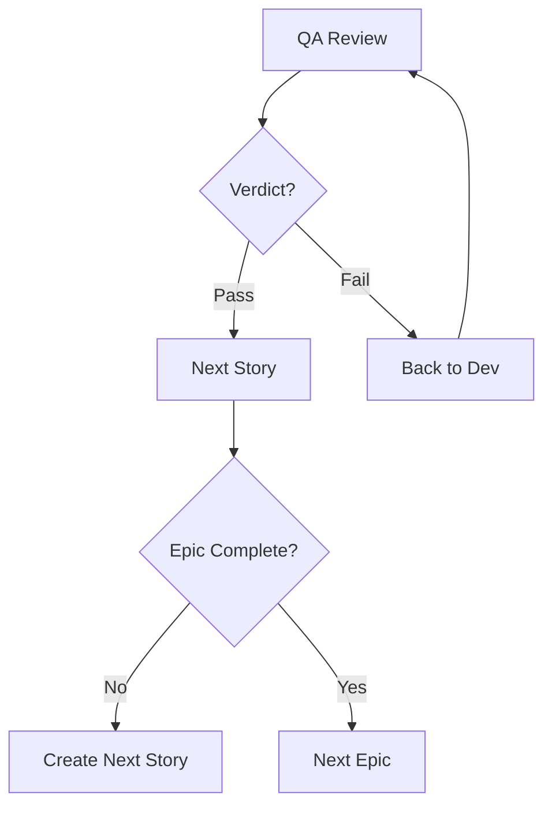

# BMAD Development Workflow Guide
## Hardcore Music Production System - Agent Integration

This guide explains how the three BMAD development agents (@sm, @dev, @qa) work together to systematically implement the Hardcore Music Production System using your existing planning documentation.

## Agent Overview

### @sm - Scrum Master (Alex)
**Role**: Story creation and sprint management
**Focus**: Breaking down epics into implementable stories with complete context
**Key Files**: 
- Reads: `bmad-development/epics/`, `bmad-planning/` docs
- Creates: `bmad-development/stories/` files

### @dev - Developer (Morgan)  
**Role**: Feature implementation from stories
**Focus**: Building features following architectural patterns
**Key Files**:
- Reads: Story files, `CLAUDE.md`, Architecture Spec
- Modifies: Source code, updates story Dev Agent Record

### @qa - QA Engineer (Casey)
**Role**: Quality validation and testing
**Focus**: Ensuring implementations meet requirements and quality standards
**Key Files**:
- Reads: Story files, implementation code, test results
- Updates: Story QA Results section

## Complete Development Workflow

### Phase 1: Story Creation (@sm)

```mermaid
graph LR
    Epic[Epic File] --> SM[@sm Agent]
    PRD[PRD] --> SM
    Arch[Architecture] --> SM
    SM --> Story[Story File]
```

1. **Activate Scrum Master**:
   ```
   Load docs/bmad-agents/@sm.md
   ```

2. **Create Story from Epic**:
   ```
   @sm: *decompose epic-01-prototyper.md
   ```
   
   The SM agent will:
   - Analyze the epic requirements
   - Reference PRD for functional requirements
   - Pull architectural guidance from Architecture Spec
   - Include testing requirements from validation strategy
   - Size the story appropriately
   - Create story file with complete context

3. **Story Output**:
   ```
   docs/bmad-development/stories/story-phase1-prototyper-001.yaml
   ```

### Phase 2: Implementation (@dev)

```mermaid
graph LR
    Story[Story File] --> Dev[@dev Agent]
    Code[Existing Code] --> Dev
    Dev --> Impl[Implementation]
    Dev --> Tests[Tests]
    Dev --> Update[Update Story]
```

1. **Activate Developer**:
   ```
   Load docs/bmad-agents/@dev.md
   ```

2. **Load and Implement Story**:
   ```
   @dev: *load story-phase1-prototyper-001.yaml
   @dev: *develop
   ```
   
   The Dev agent will:
   - Read all story sections for context
   - Follow architectural patterns specified
   - Implement each task systematically
   - Write tests for new code
   - Update story checkboxes as tasks complete
   - Document implementation in Dev Agent Record

3. **Validate Implementation**:
   ```
   @dev: *test
   @dev: *validate
   ```

4. **Story Status Update**:
   - All tasks marked [x]
   - File list updated
   - Status: "Ready for Review"

### Phase 3: Quality Assurance (@qa)

```mermaid
graph LR
    Story[Completed Story] --> QA[@qa Agent]
    Code[Implementation] --> QA
    QA --> Review[Code Review]
    QA --> Tests[Run Tests]
    QA --> Report[QA Report]
```

1. **Activate QA Engineer**:
   ```
   Load docs/bmad-agents/@qa.md
   ```

2. **Review Story Implementation**:
   ```
   @qa: *review story-phase1-prototyper-001.yaml
   ```
   
   The QA agent will:
   - Review code against acceptance criteria
   - Verify architectural compliance
   - Run all test suites
   - Validate audio quality (if applicable)
   - Check performance requirements
   - Document findings in QA Results

3. **QA Verdict**:
   - Pass: Ready for next story
   - Conditional Pass: Minor fixes needed
   - Fail: Return to developer

### Phase 4: Iteration and Completion



## Practical Example: Phase 1 Prototyper

### Day 1: Story Creation

**Human**: Load @sm agent and create first story from Phase 1 epic
```
Load docs/bmad-agents/@sm.md
*decompose epic-01-prototyper.md
```

**@sm**: Creates `story-phase1-prototyper-001.yaml`:
- Generate musical idea from text prompt
- Establish Poetry/Pydantic foundation
- Consolidate AI logic

### Day 2: Implementation

**Human**: Load @dev agent and implement story
```
Load docs/bmad-agents/@dev.md
*load story-phase1-prototyper-001.yaml
*develop
```

**@dev**: Implements:
- Creates `GenerationService` class
- Integrates with `intelligent_music_agent_v2.py`
- Writes unit tests
- Updates story with completion status

### Day 3: Quality Review

**Human**: Load @qa agent and review implementation
```
Load docs/bmad-agents/@qa.md
*review story-phase1-prototyper-001.yaml
```

**@qa**: Reviews and validates:
- Tests pass with 90% coverage
- Audio generation works
- Performance meets requirements
- Updates QA Results with "Pass"

### Day 4: Next Story

Cycle continues with next story in epic...

## Agent Persistence and Context

### Maintaining Context Between Sessions

Each agent maintains context through:

1. **Story Files**: Central source of truth
2. **Agent Memory**: Current epic, completed stories, decisions
3. **Documentation**: Updates to planning docs as needed

### Context Handoffs

When switching agents:
```
@sm: Story created with ID story-phase1-prototyper-001
     Status: Ready for Development

@dev: Loading story-phase1-prototyper-001
      Implementing requirements...
      Status: Ready for Review

@qa: Reviewing story-phase1-prototyper-001
     Running quality checks...
     Status: Pass
```

## Key Success Patterns

### 1. Complete Context in Stories
SM agent ensures every story contains:
- Full requirements from PRD
- Architectural guidance
- Testing requirements
- Existing code references
- Clear acceptance criteria

### 2. Systematic Implementation
Dev agent follows structured approach:
- Read story completely first
- Implement incrementally
- Test each component
- Update story progress
- Document decisions

### 3. Thorough Validation
QA agent performs comprehensive review:
- Code quality checks
- Test execution
- Performance validation
- Audio quality (music-specific)
- Architecture compliance

### 4. Clear Communication
Agents communicate through:
- Story file updates
- Status transitions
- Detailed notes in designated sections
- Blocking issue escalation

## Music Production Specific Workflow

### Audio Feature Stories

**SM Creates Story**:
- Specifies BPM, key, genre requirements
- References HARDCORE_PARAMS from CLAUDE.md
- Includes audio quality criteria

**Dev Implements**:
- Uses MIDIClip data model
- Applies genre-specific synthesis
- Ensures <20ms latency for real-time

**QA Validates**:
- Tests audio for artifacts
- Verifies genre authenticity
- Checks performance metrics

### MIDI Pattern Stories

**SM Creates Story**:
- Defines pattern structure
- Specifies timing requirements
- References existing generators

**Dev Implements**:
- Extends pattern generators
- Uses standard MIDI ranges
- Implements with MIDIClip

**QA Validates**:
- Tests MIDI accuracy
- Verifies timing precision
- Checks velocity dynamics

## Troubleshooting Common Issues

### Story Too Large
- SM should break into smaller stories
- Target 4-8 hour implementation chunks
- Create dependency chain

### Missing Context
- Dev requests SM to update story
- Add missing requirements
- Reference appropriate docs

### Test Failures
- QA documents specific failures
- Dev fixes and re-validates
- QA performs re-review

### Architecture Violations
- QA flags in review
- Dev refactors to comply
- Reference Architecture Spec

## Progress Tracking

### Sprint Level
```
Epic 1: The Prototyper
├── Story 001: ✅ Complete
├── Story 002: 🔄 In Review  
├── Story 003: 👨‍💻 In Development
└── Story 004: 📝 Ready for Dev
```

### Epic Level
```
Phase 1: The Prototyper (40% Complete)
Phase 2: The Instrument (Not Started)
Phase 3: The Partner (Not Started)
Phase 4: The Studio (Not Started)
```

## Quick Command Reference

### @sm Commands
- `*help` - Show available commands
- `*draft` - Create next story
- `*decompose {epic}` - Break down epic
- `*status` - Show epic progress
- `*sequence` - Display story dependencies

### @dev Commands
- `*help` - Show available commands
- `*load {story}` - Load story file
- `*develop` - Start implementation
- `*test` - Run tests
- `*validate` - Check acceptance criteria

### @qa Commands
- `*help` - Show available commands
- `*review {story}` - Review implementation
- `*test-audio` - Validate audio quality
- `*architecture` - Check compliance
- `*performance` - Run benchmarks

## Summary

This workflow enables systematic development through:
1. **Clear Requirements**: SM creates comprehensive stories
2. **Focused Implementation**: Dev builds from complete context
3. **Quality Assurance**: QA validates thoroughly
4. **Continuous Progress**: Agents work in sequence

The agents handle the complexity of coordinating between planning documents, existing code, and new development, allowing you to focus on strategic decisions while they handle execution details.